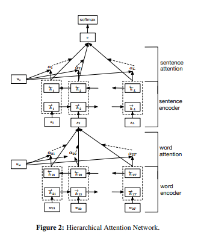

# Hierarchical Attention Networks (HAN) cho Document Classification


Dự án này là bản cài đặt (implementation) của mô hình **Hierarchical Attention Networks (HAN)** bằng ngôn ngữ Python (PyTorch), dùng để giải quyết bài toán Phân loại Văn bản (Document Classification). Mô hình dựa trên kiến trúc gốc được đề xuất trong bài báo:
> [Hierarchical Attention Networks for Document Classification](https://aclanthology.org/N16-1174/) của Yang cùng các cộng sự (2016).

---

## Kiến trúc mạng (Architecture)
Mô hình HAN xử lý trực tiếp cấu trúc phân tầng tự nhiên của văn bản (từ -> câu -> văn bản) thay vì coi văn bản chỉ là một chuỗi từ dài. Kiến trúc được chia thành 4 lớp:
1. **Word Encoder**: Sử dụng Mạng thần kinh truy hồi 2 chiều (Bidirectional GRU) để mã hóa từng từ trong các câu.
2. **Word Attention**: Cơ chế Soft Attention để tập trung (tính trọng số) vào các từ quan trọng làm nổi bật ý nghĩa của câu.
3. **Sentence Encoder**: Sử dụng Bi-GRU để mã hóa các chuỗi cấp độ câu thành dạng vector biểu diễn toàn bộ tài liệu.
4. **Sentence Attention**: Cơ chế Soft Attention để tập trung vào những câu quan trọng trong toàn bộ đoạn văn.
5. **Classifer**: Feed-forward layer (tùy chọn kết hợp cùng softmax) phân loại nhãn tài liệu từ output của bộ sentence encoder.


---

## Cài đặt Môi trường
Dự án yêu cầu cài đặt Python 3.8+ và các thư viện trong danh sách sau:

```bash
pip install -r requirements.txt
```

Các thư viện chính bao gồm: `torch` (cho model), `pandas`, `scikit-learn`, `numpy` (chuẩn bị dữ liệu) và `gensim`.

---

## Cấu trúc thư mục

```
Hierarchical_Attention_Networks/
│
├── data/                 # Thư mục chứa dữ liệu thô (ví dụ: ecommerceDataset.csv) 
├── src/                  # Mã nguồn chính của mô hình (Source code)
│   ├── dataset.py        # HAN Dataset - Xử lý chuyển đổi Text thành Tensor
│   ├── metrics.py        # Đánh giá chỉ số Accuracy, Loss
│   ├── model.py          # Kiến trúc Word/Sentence Encoders & HAN
│   ├── tokenizer.py      # Cơ chế chia nhỏ văn bản từ -> câu
│   ├── trainer.py        # Logic vòng lặp Train/Eval/Save checkpoint
│   └── vocabulary.py     # Sinh và mã hóa từ vựng (Vocabulary mapping)
│
├── split_data.py         # Script chia nhỏ tập dữ liệu ban đầu thành Train/Valid/Test (70/15/15)
├── train.py              # Script chính dùng để chạy huấn luyện 
├── config.py             # File tùy chỉnh Data class lưu các thiết lập cấu hình & Hyper-parameters
├── requirements.txt      # Danh sách các thư viện cần cài đặt
└── README.md             # Tài liệu dự án
```

---

## Hướng dẫn Sử dụng

### 1. Chuẩn bị Dữ liệu
Bạn có thể sử dụng dữ liệu văn bản với 2 cột chính nằm ở trong file CSV: `label` (Nhãn phân loại) và `text` (nội dung). File dataset chính được đặt tại thư mục `data/` (Ví dụ: `data/ecommerceDataset.csv`).

Sau đó, tiến hành chia dữ liệu ra thành 3 tập `train.csv`, `valid.csv`, và `test.csv` (với tỉ lệ 70-15-15) bằng cách chạy lệnh:
```bash
python split_data.py
```

### 2. Huấn luyện Mô hình
Chạy file `train.py` để bat đầu huấn luyện. Tham số cần thiết tối thiểu là đường dẫn đến 2 tập: `train` và `val` cùng với số lớp mô hình `num_classes`:

```bash
python train.py --train data/train.csv --val data/valid.csv --num_classes 4
```
Chương trình sẽ tự quét qua tập `train` để sinh ra bộ Vocabulary và Dictionary (tự ánh xạ Label văn bản sang dạng Integer: VD `Books -> 0`). Lớp Checkpoint của model được mặc định lưu ở thư mục `checkpoints/`.

### 3. Tùy chỉnh (Configuración)
Toàn bộ các siêu tham số (hyperparameters) được đặt trong tệp `config.py` và có thể dễ dàng chạy bằng lệnh config. Ví dụ:
```bash
python train.py \
    --train ./data/train.csv --val ./data/val.csv \
    --num_classes 4 \
    --batch_size 64 \
    --epochs 20 \
    --lr 0.01 \
    --optimiser sgd \
    --embed_dim 200
```
---

## Hiệu năng & Đánh giá (Metrics)
Trong quá trình huấn luyện:
* Model sử dụng `ReduceLROnPlateau` Learning Rate Scheduler (giảm hệ số học sau `3` epoch nếu Validation Loss không được cải thiện).
* `Model` lưu checkpoint (`best.pt` và `latest.pt`) cùng Vocabulary.

## Citation
```bibtex
@article{
  author    = {Zichao Yang, Diyi Yang, Chris Dyer, Xiaodong He, Alex Smola, Eduard Hovy},
  title     = {Hierarchical Attention Networks for Document Classification},
  year      = {2016},
  url       = {https://aclanthology.org/N16-1174/}
}
```
---
Mục đích của dự án này là nhằm nâng cao kỹ năng trong lĩnh vực nghiên cứu NLP