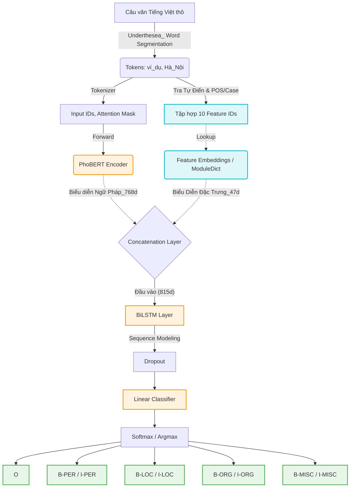

# Nhận Dạng Thực Thể Có Tên Tiếng Việt (Vietnamese NER) với PhoBERT + BiLSTM


Đây là kho lưu trữ mã nguồn cho hệ thống **Named Entity Recognition (NER)** dành riêng cho Tiếng Việt. Dự án sử dụng mô hình học sâu ngôn ngữ mạnh mẽ [PhoBERT](https://github.com/VinAIResearch/PhoBERT) (được tuỳ chỉnh từ kiến trúc RoBERTa), kết hợp với mạng học sâu thần kinh hai chiều **BiLSTM** và 10 lớp đặc trưng từ vựng (Feature Extractions) để tăng cường độ chính xác cho tiếng Việt. 

Hệ thống rút trích văn bản và phân mảng tiếng Việt được hỗ trợ thông qua [Underthesea](https://github.com/undertheseanlp/underthesea).

### Dự án cá nhân có tham khảo dự án từ github: https://github.com/phkhanhtrinh23/vietnamese_ner_bert
---

## Kiến trúc Hệ Thống

Kiến trúc dưới đây minh họa luồng đi dữ liệu kết hợp từ Văn bản thô đi qua PhoBERT (tạo ra ma trận Embeddings 768 chiều), được nối chặt (Concat) cùng với các Embeddings thủ công do mạng trích tự động và học qua Mạng R-NN BiLSTM:



---

### Cấu trúc Dữ Liệu
Bộ dataset có định dạng tương đồng theo cách xây dựng chuẩn **CoNLL-2003** với 4 cột nhãn riêng biệt: `<Word> \t <POS> \t <Chunking> \t <NER_Tag>`:

| Word      | POS | Chunk | NER   |
|-----------|-----|-------|-------|
|Dương	    |Np	  |B-NP	  |B-PER  |
|là	        |V	  |B-VP	  |O      |
|chủ        |N	  |B-NP	  |O      |
|ở	        |E	  |B-PP	  |O      |
|Hà_Nội	    |Np	  |B-NP	  |B-LOC  |

Mô hình hiện đang hỗ trợ 4 thực thể (Entities) sau:
- **PER:** Tên người (Person)
- **ORG:** Tổ chức (Organization)
- **LOC:** Địa điểm/ Địa danh (Location)
- **MISC:** Các loại khác (Miscellaneous)
- **O:** Những nhóm từ không thuộc bất kỳ tập nào kể trên

*Theo quy ước gán nhãn, `B-` phản ánh từ dẫn đầu (Begin), `I-` ám chỉ chữ nối tiếp giữa dòng cho thực thể liên tục (Intermediate).*

---

##  Huấn Luyện (Training)

**Bước 1:** Trích xuất file dữ liệu gốc `.txt` trong `data/raw_data/` để chia 70% Training - 30% Validation
```bash
python create_data.py
```

**(Tuỳ chọn):** Gắn thêm tính năng sinh nhãn tự động Feature Extraction cho dataset (thêm cờ `--dict_dir resources`):
```bash
mkdir -p feat_data
python preprocess.py --data_dir new_data/ --output_dir feat_data/ --dict_dir resources
```

**Bước 2:** Bắt đầu Fine-tuning với base **PhoBERT** (Tự động tải trọng số về từ repository HuggingFace):
```bash
python train.py \
    --data_dir new_data/ \
    --model_name_or_path vinai/phobert-base \
    --output_dir outputs \
    --max_seq_length 128 \
    --train_batch_size 16 \
    --learning_rate 2e-5 \
    --num_train_epochs 20 \
    --cuda True
```

---

## Đánh Giá & Suy Luận (Inference)
Dự đoán và trích xuất thực thể theo dạng từ - nhãn từ tệp văn bản hoặc tương tác nhập lệnh (`predict.py`):

```bash
python predict.py --pretrain_dir outputs/
```

Màn hình Terminal sẽ chuyển thành Terminal giao diện dòng lệnh cho phép người dùng truyền bất kỳ câu chữ nào: 
> **Enter text**: `Đại học Bách Khoa Hà Nội là nơi ông Nguyễn Tử Quảng từng theo học.`
> ```
> [('Đại_học_Bách_Khoa_Hà_Nội', 'ORG'), ('Nguyễn_Tử_Quảng', 'PER')] 
> ```

Sinh file dự đoán với quy chuẩn CSV cho các tập lệnh Testing (ví dụ test file `.txt`):
```bash
python create_output.py --pretrain_dir outputs/
```

---

*Base NER project implementation initialized matching VinAI's framework pipeline standards. Powered fully by HuggingFace ecosystems*.
